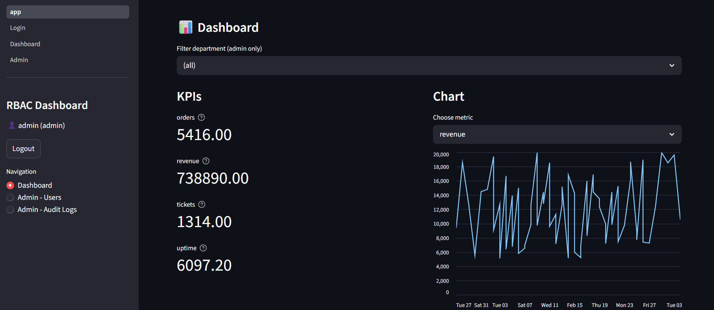
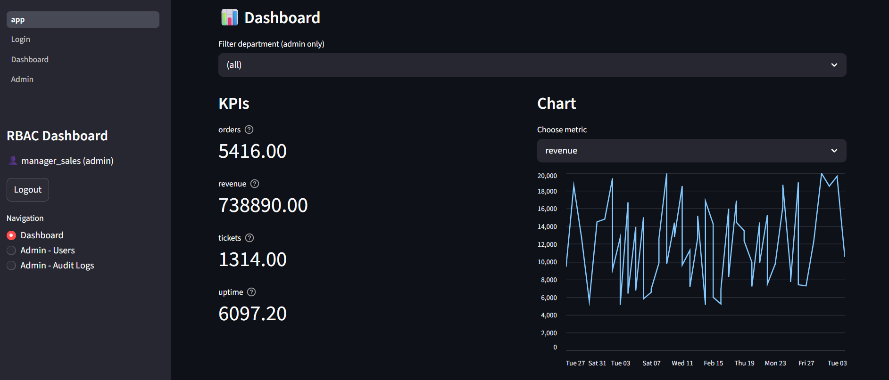
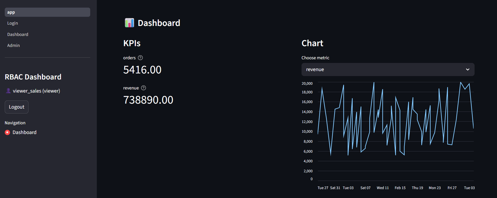
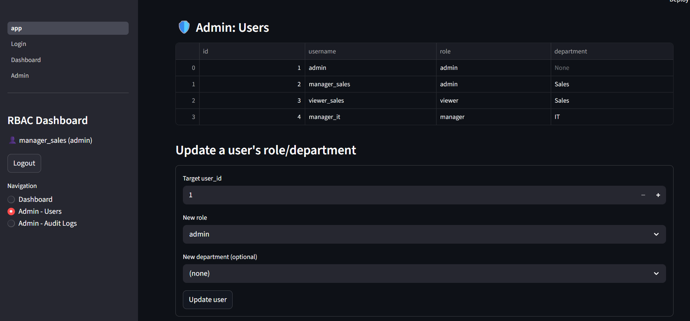
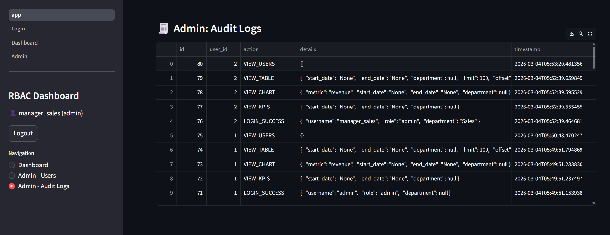

# RBAC Analytics Dashboard

A full-stack **Role-Based Access Control (RBAC) analytics dashboard** built with **FastAPI** and **Streamlit**.

This system demonstrates **secure authentication, role-based authorization, KPI analytics dashboards, and audit logging**. Different user roles have different access levels to data and administrative tools.

---

# Project Overview

This project simulates a real-world analytics platform where users log in and access dashboards depending on their **role and department**.

The backend provides secure REST APIs, while the frontend visualizes analytics through a simple interactive dashboard.

---

# Key Features

### Secure Authentication
- JWT-based authentication
- Password hashing using Passlib
- Secure login endpoints

### Role-Based Access Control (RBAC)

Three roles are implemented:

| Role | Permissions |
|-----|-----|
| Admin | Full access to dashboard, users, and audit logs |
| Manager | Access analytics for their department |
| Viewer | Read-only dashboard access |

### Analytics Dashboard
- KPI summary metrics
- Interactive charts
- Filterable data tables
- Department-level access control

### Admin Tools
- View all users
- Modify user roles
- Manage departments

### Audit Logging

Important actions are logged for monitoring:

- User login
- Role updates
- Data exports
- Administrative actions

---

# Tech Stack

### Backend
- **FastAPI**
- **SQLAlchemy**
- **Pydantic**
- **JWT Authentication**
- **SQLite Database**

### Frontend
- **Streamlit**
- **Pandas**
- **Requests**

### Other Tools
- Python Virtual Environment
- Git & GitHub

---

# System Architecture
Browser
│
▼
Streamlit Frontend
│
▼
FastAPI Backend (REST API)
│
▼
SQLite Database

---

# Screenshots

## Screenshots

### Admin Dashboard

### Manager Dashboard

### Viewer Dashboard

### Admin User Management

### Audit Logs

---

# Installation Guide

## 1 Clone the repository
git clone https://github.com/sufiaTech/RBAC-analytics-dashboard.git

cd RBAC-analytics-dashboard

---

## 2 Setup Backend
cd backend
python -m venv .venv
.venv\Scripts\activate
pip install -r requirements.txt

---

## 3 Seed the Database
python seed.py

This will create initial users and sample data.

---

## 4 Start the Backend Server

API documentation will be available at:
http://127.0.0.1:8000/docs

---

## 5 Start the Frontend

Open another terminal:
cd frontend
pip install -r requirements.txt
streamlit run app.py

Dashboard will open at:
http://localhost:8501

---

# Example User Accounts

| Username | Password | Role |
|--------|--------|--------|
| admin | adminpassword | Admin |
| manager_sales | managerpassword | Manager |
| viewer_sales | viewerpassword | Viewer |

---

# Project Structure

---

# Example User Accounts

| Username | Password | Role |
|--------|--------|--------|
| admin | adminpassword | Admin |
| manager_sales | managerpassword | Manager |
| viewer_sales | viewerpassword | Viewer |

---

# Project Structure
RBAC-analytics-dashboard
│
├── backend
│ ├── main.py
│ ├── auth.py
│ ├── crud.py
│ ├── models.py
│ ├── schemas.py
│ └── seed.py
│
├── frontend
│ ├── app.py
│ ├── utils.py
│ └── pages
│
├── screenshot
│
├── README.md
└── .gitignore

---

# Future Improvements

Possible improvements for production systems:

- Docker containerization
- PostgreSQL database
- Role permission matrix
- Advanced analytics charts
- Cloud deployment
- Token refresh mechanism

---

# Author

**SufiaTech**

This project demonstrates:

- Backend API development
- Authentication systems
- Role-based access control
- Data analytics dashboards
- Full-stack integration

---

# License

This project is open source and available under the MIT License.
